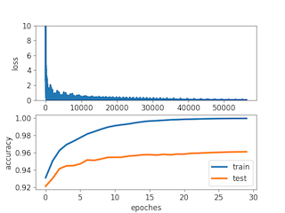

# mnistClassifier

## Network architecture


## Train
To train the network, you can use any of these two commands

```python
python main.py
python main.py train
```
## Test
To test the network, the following command should be used

```python
python main.py test
```
## Inference
To infer images under a directory, the following command should be used

```python
python main.py inference ./testSample
```
The last argument is the directory path leading to images

## Result
The train process is demonstrated in the following figure


